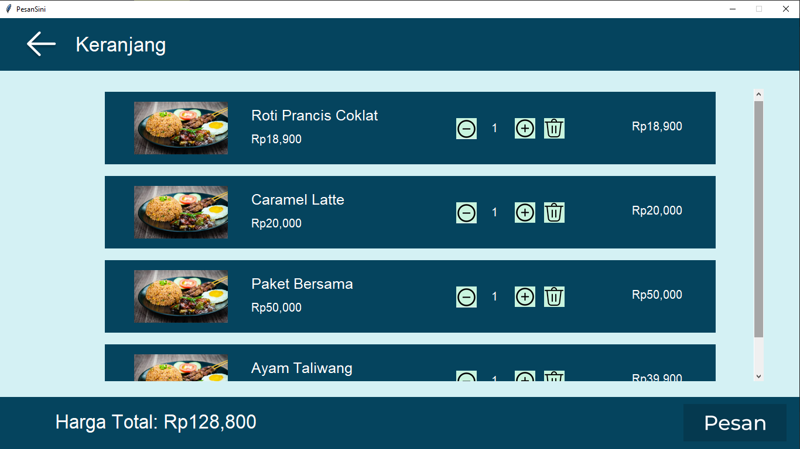

# Tugas Besar IF3152 Rekayasa Perangkat Lunak STI
# PesanSini

## Daftar Isi
- [Deskripsi Singkat Aplikasi](#deskripsi-singkat-aplikasi)
- [Cara Menjalankan Aplikasi](#cara-menjalankan-aplikasi)
- [Batasan Aplikasi](#batasan-aplikasi)
- [Daftar Modul yang Diimplementasi](#daftar-modul-yang-diimplementasi)
- [Daftar Tabel Basis Data](#daftar-tabel-basis-data)
- [Author](#author)

## Deskripsi Singkat Aplikasi
PesanSini merupakan sebuah sistem aplikasi pemesanan makanan pada sebuah restoran. Dengan adanya sistem ini, pelanggan restoran atau user dari perangkat lunak ini dapat melakukan pemesanan makanan dan minuman melalui aplikasi PesanSini tanpa perlu mendatangi meja pemesanan atau memanggil pelayan restoran. Aplikasi ini berbasis desktop app dalam bahasa Python. Pengguna yang memakai aplikasi ini yaitu pelanggan restoran. <br/>

Pengunjung restoran yang mengakses perangkat lunak PesanSini akan langsung diarahkan ke homepage yang berisi daftar makanan berdasarkan kategorinya (makanan, minuman, snack, dll.). Pengunjung dapat menambahkan menu ke keranjang dengan menekan tombol `Tambahkan ke keranjang` yang otomatis menu tersebut akan tertambah ke keranjang. Pengunjung juga dapat melihat detail menu berupa nama, harga, deskripsi, kategori, dan stok. Pengunjung juga dapat mencari menu dengan menekan tombol search dan memasukkan nama menu yang ingin dicari. <br/>

Pengunjung dapat melihat menu yang sudah ditambahkan ke keranjang dengan menekan tombol keranjang. Selain itu, pengunjung dapat mengubah kuantitas menu yang dipesan. Setelah pengunjung menekan tombol `Pesan`, pengunjung akan diarahkan ke halaman konfirmasi pesanan untuk mengisi nama dan nomor meja. Setelah itu, pengunjung dapat menekan tombol `Bayar` dan melakukan pembayaran di kasir. <br/>

## Batasan Aplikasi
* Hanya dapat diakses sebagai Desktop App
* Python versi 3.7
* Install MySQL dan MySQL connector
* Penyimpanan masih lokal

## Cara Menjalankan Aplikasi
1. Ubah Password MySQL pada `pageManager.py` sesuai dengan Password MySQL pengguna.
2. Import `PesanSini.sql` ke database lokal pengguna.
2. Jalankan program `main.py` dengan menjalankan perintah `py src/main.py` pada *command prompt*.
3. Jika berhasil dijalankan, maka akan terdapat tampilan *window* pada komputer.

## Daftar Modul yang Diimplementasi
### 1. PesanSini
Modul PesanSini merupakan modul _main_ untuk aplikasi PesanSini.

### 2. Pengolahan pencarian
Modul Pengolahan Pencarian menerapkan Pencarian, Menu, Deskripsi, dan tambah menu ke keranjang.

### 3. Menampilkan seluruh menu
Modul Menampilkan seluruh menu menerapkan _main_, Menu, dan Deskripsi, dan tambah menu ke keranjang.


### 4. Menampilkan isi keranjang
Modul Menampilkan isi keranjang menerapkan Keranjang, Edit Keranjang dan hapus menu dari keranjang.



### 5. Melakukan pemesanan
Modul Melakukan pemesanan menerapkan Keranjang dan Konfirmasi Pesanan.


### 6. Menampilkan detail pesanan
Modul Menampilkan detail pesanan menerapkan Konfirmasi Pesanan dan Detail Pesanan.


## Daftar Tabel Basis Data
* Tabel Menu
```
+----------------+---------------+------+-----+---------+----------------+
| Field          | Type          | Null | Key | Default | Extra          |
+----------------+---------------+------+-----+---------+----------------+
| ID_menu        | int(11)       | NO   | PRI | NULL    | auto_increment |
| nama_menu      | varchar(500)  | NO   |     | NULL    |                |
| foto_menu      | varchar(100)  | YES  |     | NULL    |                |
| deskripsi_menu | varchar(1000) | NO   |     | NULL    |                |
| harga_menu     | int(11)       | NO   |     | NULL    |                |
| jenis_menu     | varchar(100)  | NO   |     | NULL    |                |
| stok_menu      | int(11)       | NO   |     | NULL    |                |
+----------------+---------------+------+-----+---------+----------------+
```
* Tabel Keranjang
```
+-------------------+---------+------+-----+---------+----------------+
| Field             | Type    | Null | Key | Default | Extra          |
+-------------------+---------+------+-----+---------+----------------+
| ID_keranjang      | int(11) | NO   | PRI | NULL    | auto_increment |
| ID_menu           | int(11) | NO   | MUL | NULL    |                |
| kuantitas_pesanan | int(11) | NO   |     | NULL    |                |
+-------------------+---------+------+-----+---------+----------------+
```
* Tabel pesanan
```
+-------------------+---------+------+-----+---------+-------+
| Field             | Type    | Null | Key | Default | Extra |
+-------------------+---------+------+-----+---------+-------+
| ID_pesanan        | int(11) | NO   | PRI | NULL    |       |
| ID_keranjang      | int(11) | NO   | MUL | NULL    |       |
| ID_menu           | int(11) | NO   | MUL | NULL    |       |
| kuantitas_pesanan | int(11) | NO   |     | NULL    |       |
+-------------------+---------+------+-----+---------+-------+
```
* Tabel DetailPesanan
```
+----------------+--------------+------+-----+---------+-------+
| Field          | Type         | Null | Key | Default | Extra |
+----------------+--------------+------+-----+---------+-------+
| ID_pesanan     | int(11)      | NO   | PRI | NULL    |       |
| nomor_meja     | int(11)      | NO   |     | NULL    |       |
| nama_pelanggan | varchar(500) | NO   |     | NULL    |       |
| harga_total    | int(11)      | NO   |     | NULL    |       |
| timestamp      | datetime     | YES  |     | NULL    |       |
+----------------+--------------+------+-----+---------+-------+
```

## Author
* [Stephanie Hutagalung - 18220001](https://github.com/srnstephanie)
* [Ayub Seipanya - 18220033](https://github.com/AyubSeipanya123)
* [Amelia Wahyu Dewanti - 18220043](https://github.com/meliawd)
* [Hefin Immanuel Ginting - 18220065](https://github.com/Hefin-Gtg)
* [Hanifah Ghina Nabila - 18220107](https://github.com/hanifahgn)
